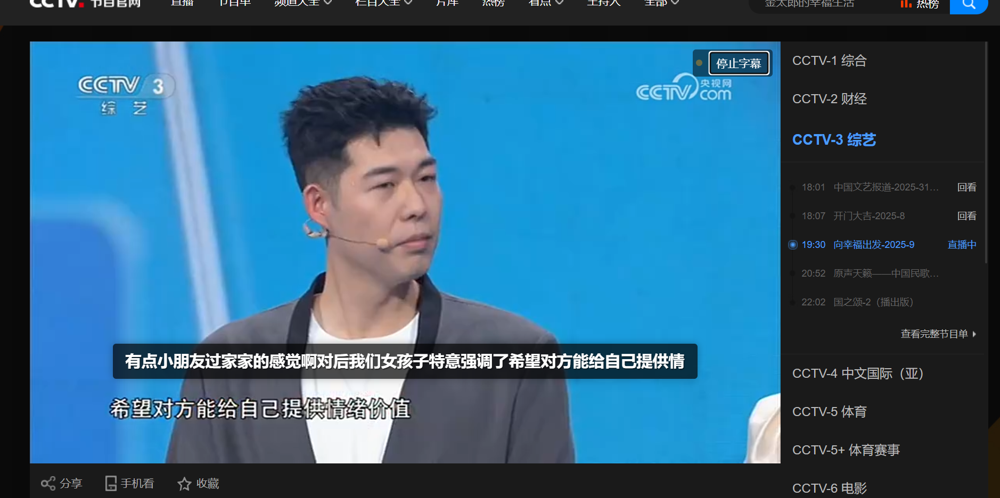

# Whisper Web

基于faster-whisper的在线视频字幕工具，包含Web应用和浏览器插件。

<p align="center">
  
  
  
</p>

## 项目概述

Whisper Web 是一个基于 OpenAI 的 Whisper 模型的在线视频字幕生成工具，使用 faster-whisper 作为后端引擎，提供了简单易用的 Web 界面和浏览器插件，让用户可以轻松为视频添加高质量的字幕。

本项目包含四个主要部分：

- **后端服务**：基于 FastAPI 和 faster-whisper 的 API 服务，负责处理视频/音频文件并生成字幕
- **浏览器插件**：Chrome/Firefox 扩展，可以为任意网站上的视频添加实时字幕 (stream流式和视频播放网站)


## 功能特点

- **视频上传和URL导入**：支持本地视频上传和网络视频URL导入
- **实时语音识别**：使用 faster-whisper 模型进行高精度语音识别
- **多语言支持**：支持中文、英文、日语等多种语言的识别和转录
- **字幕编辑和导出**：支持 VTT、SRT 和 JSON 格式的字幕导出
- **浏览器扩展**：为任意网站上的视频添加实时字幕
- **智能视频检测**：自动识别页面中的主要视频元素
- **CUDA加速支持**：支持GPU加速，提供更快的处理速度
- **响应式设计**：适配各种设备，包括桌面和移动设备

## 系统要求

- Python 3.8+
- yt-dlp（用于从各种视频网站提取音频）
- 至少 4GB RAM（推荐 8GB+，特别是使用较大的模型时）
- 支持 CUDA 的 NVIDIA GPU（可选，但推荐用于更快的处理速度）
- [CUDA lib](https://github.com/Purfview/whisper-standalone-win/releases/tag/libs) 下载

## 项目结构

```
whisper-web/
├── server/                         # 后端服务
│   ├── app/                        # FastAPI 应用
│   │   ├── main.py                 # 主应用入口和WebSocket服务
│   │   ├── browser_extension.py    # 浏览器扩展相关API
│   │   └── models.py               # 数据模型定义
│   ├── stream_whisper/             # 流式转录模块
│   ├── audio_downloader/           # 音频下载模块
│   ├── streaming_sensevoice/       # 语音识别模块
│   ├── temp/                       # 临时文件目录
│   ├── subtitles/                  # 字幕文件输出目录
│   ├── requirements.txt            # Python 依赖
│   └── run.py                      # 启动脚本
├── extension/                      # stream流式浏览器插件
│   ├── manifest.json               # 插件配置
│   └── popup.html                  # 弹出窗口
└── web-extension/                  # yt-dlp支持的视频播放网站浏览器扩展
    ├── src/
    │   ├── popup.html              # 扩展弹出窗口界面
    │   ├── popup.js                # 弹出窗口逻辑
    │   ├── content.js              # 内容脚本（处理页面视频）
    │   └── background.js           # 后台脚本（处理API请求）
    ├── public/                     # 静态资源
    └── manifest.json               # 扩展配置文件
```

## 快速开始

### 1. 克隆仓库

```bash
git clone https://github.com/your-username/whisper-web.git
cd whisper-web
```

### 2. 安装后端服务

```bash
cd server
pip install -r requirements.txt
```

### 3. 安装浏览器扩展

```bash
cd ../web-extension
# 在Chrome中加载已解压的扩展
```

### 4. 配置环境

编辑 `server/.env` 文件：

```
# 服务器配置
HOST=0.0.0.0
PORT=8000
RELOAD=True

# Whisper模型配置
MODEL_SIZE=base  # 可选: tiny, base, small, medium, large
DEVICE=cuda     # 或 cpu
COMPUTE_TYPE=float16  # 或 int8
```

### 5. 运行服务

```bash
cd server
python run.py
```

服务器将在 http://localhost:8000 启动。

## 使用方法

### 浏览器扩展

1. 访问包含视频的网页（如 YouTube、Bilibili 等）
2. 点击浏览器工具栏中的扩展图标
3. 在弹出窗口中点击"为当前视频生成字幕"按钮
4. 等待音频提取和转录完成
5. 字幕将自动添加到视频中并显示


## 浏览器插件直播字幕演示



## 支持的视频网站

本项目使用 yt-dlp 提取音频，支持大量视频网站，包括但不限于：

- YouTube
- Bilibili (B站)
- 爱奇艺
- 腾讯视频
- 优酷
- 芒果TV
- 搜狐视频
- Vimeo
- Dailymotion
- 各类教育平台

## 注意事项

- 确保有足够的磁盘空间用于临时文件和字幕存储
- 使用CUDA时需要安装对应的NVIDIA驱动和CUDA工具包
- 临时文件会在1小时后自动清理
- 建议在生产环境中配置适当的CORS策略
- 某些网站可能限制内容访问，导致音频提取失败

## 感谢

- [Purfview](https://github.com/Purfview/whisper-standalone-win) 提供的CUDA lib
- [yt-dlp](https://github.com/yt-dlp/yt-dlp) 提供的音频提取功能
- [faster-whisper](https://github.com/m-bain/whisperx) 提供的语音识别功能
- [SenseVoice](https://github.com/SenseVoice/SenseVoice) 提供的语音识别功能
## 许可证

MIT
